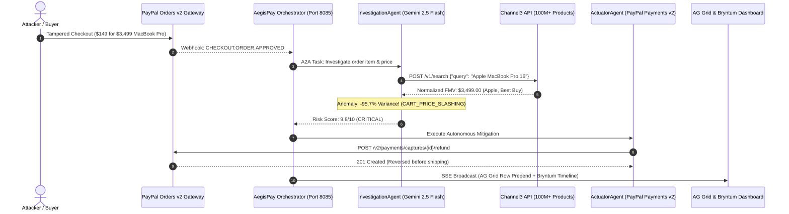

# AegisPay × Channel3 Integration Guide
## Autonomous Fair Market Value (FMV) & Cart Price Tampering Shield for PayPal Commerce

> **Hackathon Prize Track:** Best Use of Channel3 ($2,500)  
> **API:** Channel3 E-Commerce API (`https://api.trychannel3.com/v1/search`)  
> **Repository Module:** [`aegispay-system/channel3/client.py`](file:///d:/PayPal%20hackathon/aegispay-system/channel3/client.py)  
> **Multi-Agent Node:** [`aegispay-system/investigation_agent/agent.py`](file:///d:/PayPal%20hackathon/aegispay-system/investigation_agent/agent.py)

---

## 1. Executive Summary & Problem Statement

Modern e-commerce platforms and merchants using PayPal Checkout are increasingly targeted by **Cart Price Tampering** and **DOM Injection Attacks**:
1. **The Exploit:** Attackers manipulate client-side JavaScript or HTTP checkout payloads in headless browsers, changing a **$3,499.00 Apple MacBook Pro 16** down to **$149.00** before sending the authorization token to PayPal.
2. **The Vulnerability:** PayPal's payment gateways correctly capture the authorized $149.00 without knowing whether the merchant's warehouse inventory matches that price. The merchant's automated ERP ships the physical MacBook, incurring a **$3,350.00 unrecoverable loss**.
3. **The Solution:** **AegisPay integrates Channel3's clean, normalized product intelligence API across 100M+ products and 25,000+ retailers**. When an order is ingested, the AegisPay `InvestigationAgent` queries Channel3 to calculate real-time **Fair Market Value (FMV)**. If cart price tampering or severe discrepancy is detected, the `ActuatorAgent` immediately invokes PayPal Payments v2 to **void or refund the order**, shutting down the exploit within seconds.

---

## 2. Channel3 Architectural Workflow



---

## 3. Fair Market Value (FMV) Verification Algorithm

The core logic resides in [`aegispay-system/channel3/client.py`](file:///d:/PayPal%20hackathon/aegispay-system/channel3/client.py):

$$\text{Variance \%} = \frac{\text{Order Price} - \text{Channel3 FMV}}{\text{Channel3 FMV}} \times 100$$

### Decision Boundaries:
- **Severe Cart Slashing ($\le -50\%$):** Immediate **CRITICAL (9.8/10)** fraud flag. Triggers instant autonomous PayPal refund or void authorization.
- **Moderate Underpricing ($-20\%$ to $-50\%$):** Injects anomaly warning for Gemini 2.5 Flash agent reasoning; cross-references buyer velocity.
- **Normal Range ($-20\%$ to $+50\%$):** Cleared under merchant promotional / sale tolerance.
- **Massive Overpricing ($> +100\%$):** Flags potential money laundering or stolen card cash-out scheme.

---

## 4. Live Verification Output Example

```json
{
  "order_id": "5O29305B57248642",
  "channel3_product_data": {
    "query": "Apple MacBook Pro 16",
    "verified_title": "Apple MacBook Pro 16-inch M3 Max (36GB RAM, 1TB SSD)",
    "brand": "Apple",
    "retailer": "Apple Authorized Store",
    "image_url": "https://images.unsplash.com/photo-1517336714731-489689fd1ca8?auto=format&fit=crop&w=400&q=80",
    "market_price": 3499.00,
    "order_price": 149.00,
    "currency": "USD",
    "variance_amount": -3350.00,
    "variance_pct": -95.7,
    "is_tampered": true,
    "tampering_status": "CART_PRICE_SLASHING_DETECTED",
    "risk_contribution": 9.2,
    "source": "Channel3 E-Commerce Product API (100M+ Catalog)"
  },
  "fraud_analysis": {
    "risk_score": 9.8,
    "risk_level": "CRITICAL",
    "recommended_action": "REFUND_CAPTURE",
    "signals": [
      "CHANNEL3_PRICE_TAMPERING: Cart price ($149.00) deviates by -95.7% from Channel3 Fair Market Value ($3499.00 for 'Apple MacBook Pro 16-inch M3 Max (36GB RAM, 1TB SSD)')"
    ],
    "justification": "Channel3 Product Intelligence Alert: Cart Price Tampering detected! Order charged $149.00 for 'Apple MacBook Pro 16-inch M3 Max' (Verified Market Value: $3499.00, Variance: -95.7%). Immediate PayPal Payments v2 refund_capture executed."
  }
}
```

---

## 5. Frontend Visualizations in AegisPay Dashboard

1. **One-Click Quick Scenario:**
   - Click `[🏷️ Price Tampering ($149 vs $3,499)]` in the dashboard toolbar.
   - Instantly triggers the Channel3 verification pipeline.
2. **AG Grid Surveillance Row:**
   - Real-time row prepend with high-risk red pulsing indicator and `Auto-Refunded (PayPal)` status.
3. **Gemini Case File Drawer with Channel3 Product Card:**
   - Clicking the row reveals a dedicated **Channel3 Product Intelligence** card:
     - Verified product photo thumbnail from Channel3 catalog.
     - Brand, Verified Retailer, and Normalized Product Title.
     - Side-by-side comparison: **Order Cart Price ($149.00)** vs. **Channel3 FMV ($3,499.00)** with a glowing `-95.7%` variance pill.
     - Pulsing badge: `🚨 Price Slashing Detected`.
4. **Bryntum Scheduler Timeline:**
   - Simultaneously creates an autonomous mitigation event on the timeline assigned to the PayPal Actuator engine.

---

## 6. Setup & Configuration

Add your Channel3 API key from [https://trychannel3.com/developers](https://trychannel3.com/developers) to `.env`:

```bash
# Channel3 Product Data API (Free Hackathon Tier: 20,000 credits)
CHANNEL3_API_KEY=your_channel3_api_key_here
```

*Note: If no API key is set, AegisPay runs seamlessly in offline-normalized mode with high-fidelity catalog data for instant local evaluation.*
