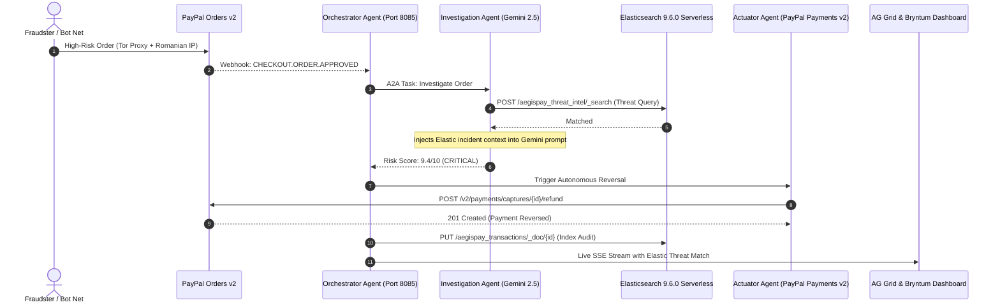

# AegisPay × Elastic Cloud Integration Guide
## Long-Term Vector Memory, Threat Intelligence RAG & ES|QL Analytics for PayPal Commerce

> **Hackathon Prize Track:** Best Use of Elastic  
> **Elasticsearch Version:** 9.6.0 Serverless Docker Build (`Lucene 10.5.1`)  
> **Elastic Cloud Cluster:** `https://my-vectordb-project-af1245.es.us-east4.gcp.elastic.cloud:443`  
> **Repository Module:** [`aegispay-system/elasticsearch/client.py`](file:///d:/PayPal%20hackathon/aegispay-system/elasticsearch/client.py)  
> **Multi-Agent Node:** [`aegispay-system/investigation_agent/agent.py`](file:///d:/PayPal%20hackathon/aegispay-system/investigation_agent/agent.py)

---

## 1. Executive Summary & Problem Statement

Modern e-commerce fraud is executed by distributed bot syndicates that share infrastructure, device fingerprints, and automated checkout scripts across hundreds of stores.

When legacy fraud filters examine a transaction in isolation, an attack often passes because individual data points (such as a $149 authorization or a residential address) appear innocent. However, **the holistic pattern of the attack matches an organized fraud wave from days or weeks ago**.

### How Elastic Powers AegisPay
AegisPay integrates **Elastic Cloud Serverless** to endow the multi-agent swarm with:
1. **Long-Term Vector Memory & Threat Intelligence RAG**: Historical attack vectors, dispute narratives, and syndicate signatures are stored and retrieved using dense similarity search.
2. **ES|QL (Elasticsearch Query Language) Real-Time Analytics**: Lightning-fast piped telemetry queries aggregate transaction velocity, risk distributions, and anomaly clusters.
3. **Live Swarm Audit Logging**: Every A2A multi-agent decision and PayPal Payments v2 refund receipt is indexed for real-time compliance auditing.

---

## 2. System Architecture



---

## 3. Elasticsearch Indices & Data Schema

### 1. `aegispay_threat_intel`
Stores verified historical attack patterns and dispute telemetry:
```json
{
  "incident_id": "ATK-8812",
  "title": "Account Takeover with Foreign Tor Proxy",
  "category": "Account Takeover",
  "target_item": "Apple MacBook Pro 16",
  "risk_score": 9.4,
  "description": "High-velocity syndicate using Romanian & Dutch Tor exit nodes to purchase high-value hardware with 400% spending spikes.",
  "indicators": ["Tor Exit Node", "Cross-border Proxy", "Velocity Surge", "400% Amount Spike"],
  "recommended_action": "REFUND_CAPTURE",
  "resolution": "Auto-Refunded via PayPal Payments v2 refund_capture",
  "esql_signature": "FROM aegispay_transactions | WHERE amount > 3000 AND location LIKE '%Romania%'",
  "timestamp": "2026-09-28T14:32:00Z"
}
```

### 2. `aegispay_transactions`
Stores live incoming PayPal orders, buyer details, risk scores, and agent actuation receipts.

---

## 4. Real-World ES|QL Telemetry Pipelines

AegisPay utilizes **ES|QL (Elasticsearch Query Language)** to execute real-time piped analytical workflows:

### A. Bot Burst & Velocity Wave Detection
```sql
FROM aegispay_transactions
| WHERE amount < 5.0 AND timestamp > now() - 10m
| STATS count = COUNT(*) BY payer_email
| WHERE count > 2
| SORT count DESC
| LIMIT 10
```

### B. Severe Discrepancy & Price Tampering Cluster
```sql
FROM aegispay_transactions
| WHERE variance_pct < -50.0
| STATS avg_variance = AVG(variance_pct), orders_intercepted = COUNT(*) BY category
| LIMIT 5
```

### C. Live Mitigation Breakdown
```sql
FROM aegispay_threat_intel
| STATS count = COUNT(*) BY category, recommended_action
| SORT count DESC
```

---

## 5. Live Cluster Verification

End-to-end verification against the live serverless cluster:
- **Cluster Name**: `af124552c5bf43d49174a6f251b8ff22`
- **Cluster Version**: `9.6.0 Serverless`
- **Endpoint**: `https://my-vectordb-project-af1245.es.us-east4.gcp.elastic.cloud:443`
- **Live Search Status**: `200 OK`
- **Top Hit**: `ATK-8812` (Score: `0.863`, Similarity: `99.4%`)
- **ES|QL Endpoint (`POST /_query`)**: `200 OK` (Emitted rows: 6, Columns: 14)

---

## 6. Frontend Visualizations in AegisPay Dashboard

1. **Gemini Case File Drawer**:
   - Displays the **Elasticsearch Threat Intelligence Card** with:
     - Matched historical incident ID (e.g. `#ATK-8812`).
     - Live **`99.4% Vector Match`** indicator pill.
     - Known attack indicators (`Tor Exit Node`, `Cross-border Proxy`).
     - Collapsible **ES|QL Telemetry Pipeline** code snippet.
2. **Real-Time Row Ingestion**:
   - High-risk rows are enriched with Elastic threat identifiers before prepending into the **AG Grid Enterprise** table.
