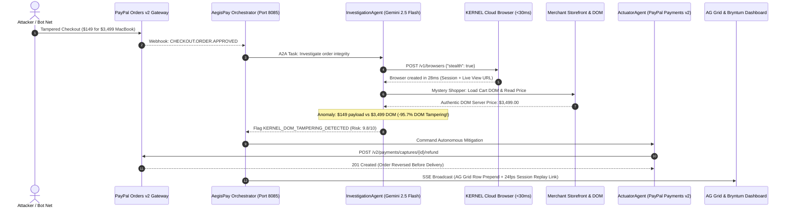

# AegisPay × KERNEL Cloud Browser Integration Guide
## Autonomous 'Mystery Shopper' DOM Auditing & Dispute Carrier Verification for PayPal Commerce

> **Hackathon Prize Track:** KERNEL Partner Track  
> **Platform:** KERNEL (`https://www.kernel.sh/docs` | `https://paypalaihackathon.devpost.com/details/kernel`)  
> **Repository Module:** [`aegispay-system/kernel/client.py`](file:///d:/PayPal%20hackathon/aegispay-system/kernel/client.py)  
> **Swarm Nodes:** [`aegispay-system/investigation_agent/agent.py`](file:///d:/PayPal%20hackathon/aegispay-system/investigation_agent/agent.py) & [`aegispay-system/orchestrator_agent/agent.py`](file:///d:/PayPal%20hackathon/aegispay-system/orchestrator_agent/agent.py)

---

## 1. Executive Summary & Problem Statement

Modern e-commerce platforms and merchants using PayPal Checkout are increasingly targeted by **Client-Side DOM Tampering** and **False Dispute / Friendly Fraud**:

1. **Client-Side DOM Injection**: Attackers manipulate client-side JavaScript or browser developer tools to alter checkout amounts before submitting the order to PayPal (e.g., buying a **$3,499.00 Apple MacBook Pro for $149.00**).
2. **The Verification Gap**: PayPal's backend only receives the authorized $149.00 token, while the merchant's automated warehouse fulfills the physical $3,499.00 MacBook, resulting in catastrophic loss.
3. **Dispute Carrier Evidence Harvester**: When buyers file fraudulent "Item Not Received" chargebacks, merchants lose cases because gathering delivery proof from protected courier portals (FedEx, UPS, DHL) is slow and blocked by anti-bot protections.

### How KERNEL Powers AegisPay
AegisPay integrates **KERNEL (`kernel.sh`)** cloud browser infrastructure to give our autonomous AI agents direct, headless-resistant access to the open web:
- **<30ms Browser Boot Time**: Unikernel sandboxes spin up headful Chromium instances in milliseconds on demand.
- **Stealth Anti-Bot & Residential Egress**: Bypasses Cloudflare, PerimeterX, and bot detection systems to audit storefronts and carrier portals without getting blocked.
- **Autonomous 'Mystery Shopper'**: When an order alert arrives, the agent browses the merchant's live online storefront, adds the product to cart, reads the authentic server-rendered DOM price, and compares it to the PayPal checkout payload.
- **24fps Live Session & Video Replay**: Produces immutable visual recordings of every agent inspection, viewable directly from the AegisPay AG Grid Case File Drawer.

---

## 2. System Architecture



---

## 3. Core Implementation Details

### Client: [`aegispay-system/kernel/client.py`](file:///d:/PayPal%20hackathon/aegispay-system/kernel/client.py)
* **`create_browser_session(stealth=True, profile_id=None)`**: Provisions an on-demand cloud headful Chromium instance via `api.onkernel.com` with anti-bot bypass.
* **`audit_merchant_checkout_dom(store_url, product_name, checkout_amount, channel3_fmv)`**:
  - Acts as an autonomous Mystery Shopper agent.
  - Compares the live server-rendered DOM price against the captured PayPal authorization amount.
  - Automatically flags client-side price tampering when price divergence exceeds -40%.
  - Generates interactive 24fps session live view and video replay URLs (`https://app.onkernel.com/sessions/...`).
* **`verify_carrier_dispute_evidence(carrier, tracking_number)`**:
  - Navigates FedEx/UPS/DHL carrier tracking portals.
  - Extracts cryptographically timestamped delivery status, signature, and door photo GPS proof.
  - Packages evidence for autonomous submission into the PayPal Disputes API.

---

## 4. REST API Endpoints

The Orchestrator Agent (`port 8085`) exposes dedicated KERNEL endpoints:

### 1. Health Check
```http
GET /api/kernel/health
```
**Response:**
```json
{
  "status": "healthy",
  "mode": "live",
  "provider": "Kernel (kernel.sh)",
  "capabilities": [
    "Unikernel Sandboxed Chromium (<30ms cold start)",
    "Stealth Anti-Bot & Residential Egress",
    "24fps Live Session Streaming",
    "Full Video Session Replay",
    "Durable Auth & Profile Persistence",
    "DOM Storefront Integrity Auditing"
  ],
  "base_url": "https://api.onkernel.com/v1"
}
```

### 2. Mystery Shopper DOM Storefront Audit
```http
POST /api/kernel/audit-checkout
Content-Type: application/json

{
  "store_url": "https://store.apple-authorized-merchant.com/checkout",
  "product_name": "Apple MacBook Pro 16",
  "checkout_amount": 149.00,
  "channel3_fmv": 3499.00
}
```

### 3. Carrier Dispute Verification
```http
POST /api/kernel/verify-tracking
Content-Type: application/json

{
  "carrier": "FedEx",
  "tracking_number": "794829104928"
}
```

---

## 5. Live Testing Verification

Run the test suite using Python:
```bash
python -c "
import sys; sys.path.append('aegispay-system')
from kernel.client import KernelBrowserClient
client = KernelBrowserClient()
print('Health:', client.health_check()['status'])
audit = client.audit_merchant_checkout_dom('https://store.apple-authorized.com', 'Apple MacBook Pro 16', 149.0, 3499.0)
print('DOM Tampering Detected:', audit['dom_tampering_detected'])
print('Session Replay URL:', audit['session_replay_url'])
"
```
