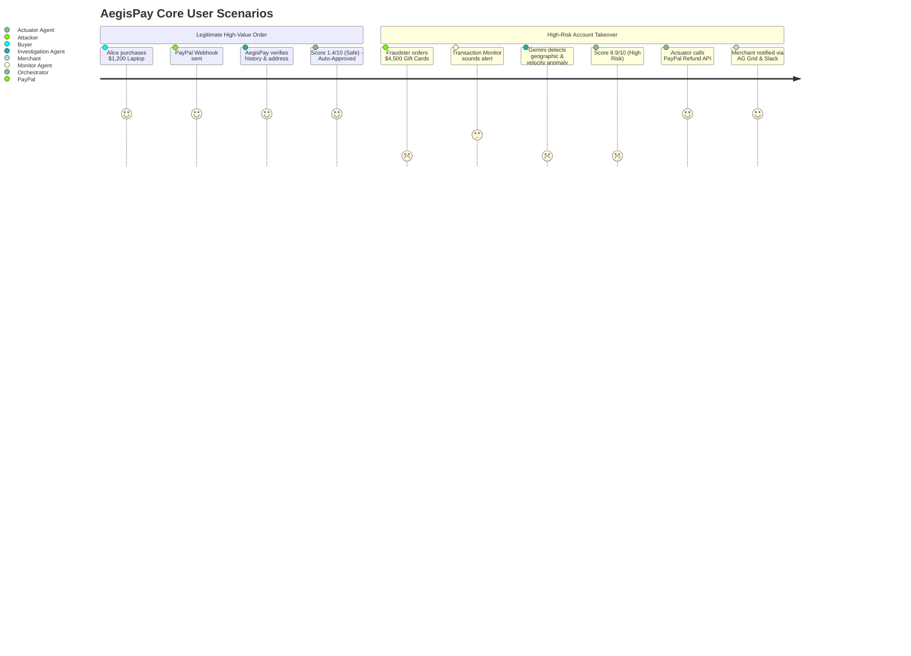
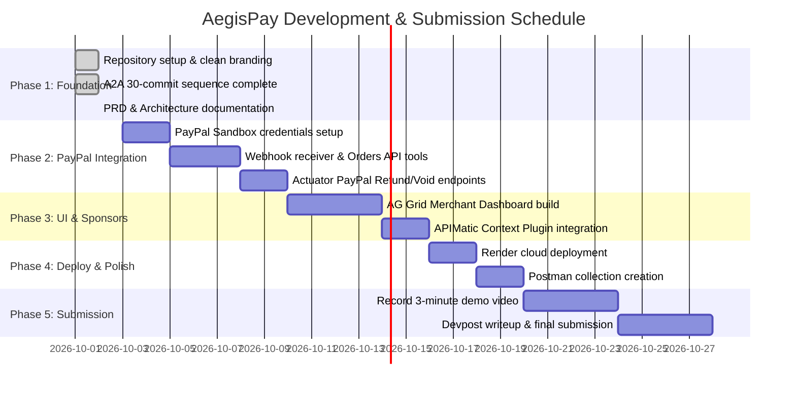

# Product Requirements Document (PRD)

# AegisPay: Autonomous Multi-Agent Fraud Shield for PayPal Commerce

| Document Attribute | Details |
| :--- | :--- |
| **Product Name** | **AegisPay** |
| **Document Version** | 1.0.0 |
| **Status** | Approved / In Development |
| **Target Hackathon** | *Build What's Next with PayPal and AI* (Devpost Global Hackathon) |
| **Repository** | [iykyk-vedant/Paypal-Hackathon_agiesPay](https://github.com/iykyk-vedant/Paypal-Hackathon_agiesPay) |
| **Primary Category Target** | Best Use of Agentic Commerce ($5,000) · Best Use of PayPal + AI ($5,000) |
| **Sponsor Track Targets** | Best Use of AG Grid ($5,000) · Best Use of Render ($1,000) · Best Use of APIMatic ($1,000) |

---

## 1. Executive Summary

**AegisPay** is an autonomous, hierarchical multi-agent artificial intelligence system designed to protect online merchants and agentic commerce workflows on the PayPal Developer Platform. 

As AI agents increasingly initiate and fulfill commercial transactions autonomously (Agentic Commerce), legacy fraud detection systems reliant on static thresholds and post-settlement reviews fail to prevent high-velocity credential theft and chargebacks. AegisPay sits between incoming PayPal transaction webhooks and fulfillment pipelines. It deploys specialized AI agents collaborating over the **Agent-to-Agent (A2A)** protocol to continuously monitor payment events, conduct automated investigations into customer behavior with **Gemini 2.5 Flash**, assign multi-factor risk scores, and autonomously execute mitigation (such as instant authorization voids or auto-refunds via PayPal APIs) before costly dispute fees are incurred.

---

## 2. Problem Statement & Opportunity

### 2.1 The Industry Pain Points
1. **The Chargeback Cliff**: In e-commerce, once a stolen card or account is captured and fulfilled, merchants bear the loss of inventory plus non-refundable chargeback dispute fees ($15–$30 per incident).
2. **False Declines Frustrate Legitimate Buyers**: Static rules (e.g., "Decline any transaction > $1,000") produce high false positive rates, turning away loyal customers making legitimate large purchases.
3. **The Rise of Agentic Commerce**: Autonomous AI agents are starting to make payments on behalf of humans. Merchants cannot rely on traditional human UI signals (mouse clicks, CAPTCHAs) and urgently need an AI-native risk reasoning engine.
4. **Latency vs. Reasoning**: Existing enterprise machine learning models output opaque numerical scores without context. Human fraud teams take hours to investigate alerts manually, by which time digital goods or physical shipments have already escaped.

### 2.2 The AegisPay Solution
AegisPay automates the entire fraud analysis lifecycle within seconds:
* **Sub-second Ingestion**: Listens directly to PayPal payment webhooks (`CHECKOUT.ORDER.APPROVED`, `PAYMENT.CAPTURE.COMPLETED`).
* **Deep Agentic Investigation**: Gathers contextual intelligence using PayPal REST APIs and executes multi-dimensional fraud reasoning using Gemini 2.5 Flash.
* **Autonomous Remediation**: Directly calls PayPal's Refund and Void APIs if the risk score exceeds safety thresholds ($\ge 7/10$), neutralizing fraud in flight.
* **Explainable AI**: Produces human-readable case justification files for every decision, viewable live in a high-performance **AG Grid** merchant dashboard.

---

## 3. Product Vision & Goals

### 3.1 Vision
To become the premier autonomous multi-agent trust layer for PayPal merchants, turning reactive fraud mitigation into proactive, real-time agentic defense.

### 3.2 Hackathon Goals & Target Award Matrix

```
┌─────────────────────────────────────────────────────────────────────────────┐
│                       AEGISPAY TARGET AWARD MATRIX                          │
├────────────────────────┬─────────────┬──────────────────────────────────────┤
│ Prize Category         │ Value       │ Key AegisPay Capability Leveraged    │
├────────────────────────┼─────────────┼──────────────────────────────────────┤
│ Best Use of            │ $5,000 Cash │ 4-agent autonomous system (A2A)      │
│ Agentic Commerce       │             │ safeguarding bot & human checkouts   │
├────────────────────────┼─────────────┼──────────────────────────────────────┤
│ Best Use of            │ $5,000 Cash │ Gemini 2.5 Flash reasoning +         │
│ PayPal + AI            │             │ PayPal Orders & Refund REST APIs     │
├────────────────────────┼─────────────┼──────────────────────────────────────┤
│ Best Use of AG Grid    │ $5,000 Cash │ Real-time interactive Merchant Ops   │
│ (1st Place)            │             │ Dashboard with Master-Detail & Action│
├────────────────────────┼─────────────┼──────────────────────────────────────┤
│ Best Use of Render     │ $1,000      │ Hosted live cloud demo & agent       │
│ (1st Place)            │ Credits     │ background workers on Render         │
├────────────────────────┼─────────────┼──────────────────────────────────────┤
│ Best Use of APIMatic   │ $1,000 Cash │ Dynamic OpenAPI context injection    │
│                        │ + 6mo Sub   │ for agent tool execution             │
└────────────────────────┴─────────────┴──────────────────────────────────────┘
```

---

## 4. User Personas & Core Use Cases

### 4.1 Personas
1. **Marcus (E-Commerce Merchant)**: Runs a high-volume online electronics store. Frequently targets fraud rings attempting to buy high-value gift cards or gaming laptops with compromised PayPal accounts.
2. **Elena (Fraud Operations Analyst)**: Needs transparent, explainable audit logs showing *why* an order was flagged or refunded, without sifting through thousands of log lines.
3. **Agent-007 (Autonomous Buyer Agent)**: An AI purchasing agent shopping across online vendors using PayPal APIs. Requires instant clearance without human CAPTCHAs.

### 4.2 Core Use Cases



---

## 5. System Architecture & Component Specifications

AegisPay utilizes a decoupled, asynchronous multi-agent architecture communicating via Google’s **Agent-to-Agent (A2A)** JSON-RPC protocol.

```
┌─────────────────────────────────────────────────────────────────────────────┐
│                         AEGISPAY SYSTEM ARCHITECTURE                        │
├─────────────────────────────────────────────────────────────────────────────┤
│                                                                             │
│   [ PayPal Sandbox Store / Webhook ]                                        │
│                  │                                                          │
│                  ▼                                                          │
│      ┌──────────────────────────┐                                           │
│      │ Transaction Monitor Agent│ ◄── Ingests checkout events               │
│      │    (Python / asyncio)    │     Applies velocity & amount filters     │
│      └─────────────┬────────────┘                                           │
│                    │ A2A Message                                            │
│                    ▼                                                        │
│      ┌──────────────────────────┐                                           │
│      │    Orchestrator Agent    │ ◄── Command brain (State Machine)         │
│      │    (Gemini 2.5 Flash)    │     Evaluates doctrine & risk escalation  │
│      └──────┬─────────────┬─────┘                                           │
│             │ A2A Task    │ A2A Command (If Risk >= 7)                      │
│             ▼             ▼                                                 │
│    ┌──────────────┐ ┌──────────────┐                                        │
│    │Investigation │ │Actuator Agent│                                        │
│    │    Agent     │ │  (FastAPI)   │                                        │
│    │ (Gemini 2.5) │ └──────┬───────┘                                        │
│    └───────┬──────┘        │                                                │
│            │               ▼                                                │
│            │        ┌─────────────────────────┐                             │
│            │        │ PayPal REST APIs        │                             │
│            ▼        │ • Refund API            │                             │
│   ┌─────────────────┤ • Void Authorization    │                             │
│   │ PayPal APIs     │ • Order Details         │                             │
│   │ (APIMatic SDK)  └─────────────────────────┘                             │
│   └────────┬────────┘                                                       │
│            ▼                                                                │
│   ┌─────────────────────────────────────────────────────────────────┐       │
│   │               AG Grid Merchant Security Dashboard               │       │
│   │   (Live feed, Risk color codes, Gemini reasoning, Action cells) │       │
│   └─────────────────────────────────────────────────────────────────┘       │
│                                                                             │
└─────────────────────────────────────────────────────────────────────────────┘
```

### 5.1 Component Specifications

#### Component 1: Transaction Monitor Agent
* **Directory**: [aegispay-system/transaction_monitor_agent](file:///d:/PayPal%20hackathon/aegispay-system/transaction_monitor_agent)
* **Function**: Continuously listens for new payment events via webhook or ledger polling.
* **Core Logic**:
  * Evaluates incoming transactions against a configurable threshold (`FRAUD_THRESHOLD`, default: `$1000.00`).
  * Formats transaction payloads into canonical A2A task objects.
  * Dispatches alerts asynchronously to the Orchestrator Agent service.

#### Component 2: Orchestrator Agent
* **Directory**: [aegispay-system/orchestrator_agent](file:///d:/PayPal%20hackathon/aegispay-system/orchestrator_agent)
* **Function**: Central coordinator and decision-maker.
* **Core Logic**:
  * Implemented with **Google ADK (Agent Development Kit)** and **Gemini 2.5 Flash**.
  * Executes the *Orchestrator Prompt Doctrine*:
    1. Delegates transaction payload to `InvestigationAgent`.
    2. Receives structured case file containing `risk_score` (0–10) and `justification`.
    3. Evaluates against `RISK_SCORE_THRESHOLD` (default: `7`).
    4. If $\ge 7$, invokes `ActuatorAgent` tool with parameters `{action: "mitigate_transaction", order_id, reason, case_file}`.
    5. If $< 7$, logs order approval and records narrative justification.

#### Component 3: Investigation Agent
* **Directory**: [aegispay-system/investigation_agent](file:///d:/PayPal%20hackathon/aegispay-system/investigation_agent)
* **Function**: The AI detective that synthesizes customer signals into an explainable fraud evaluation.
* **Core Logic**:
  * Retrieves customer profile (billing address, verified status) and past transaction history.
  * Calls Gemini 2.5 Flash with the specialized `INVESTIGATION_PROMPT`.
  * Outputs strictly formatted JSON:
    ```json
    {
      "risk_score": 8.7,
      "factors": {
        "velocity_anomaly": true,
        "geo_mismatch": true,
        "amount_deviation": "340% above 90-day average"
      },
      "justification": "Customer account originated from California but order placed from an offshore proxy IP shipping to a re-freight facility with no transaction history."
    }
    ```

#### Component 4: Actuator Agent
* **Directory**: [aegispay-system/actuator_agent](file:///d:/PayPal%20hackathon/aegispay-system/actuator_agent)
* **Function**: Deterministic policy enforcement service.
* **Core Logic**:
  * Exposes FastAPI endpoints accepting A2A remediation commands.
  * Interacts with PayPal Sandbox API:
    * `POST /v2/payments/captures/{capture_id}/refund`: Instantly refunds high-risk captured orders.
    * `POST /v2/checkout/orders/{order_id}/void`: Cancels authorized orders prior to capture.
  * Updates merchant audit log with `TRANSACTION_MITIGATED_BY_AEGISPAY`.

#### Component 5: GenAI Toolbox & APIMatic Layer
* **Directory**: [aegispay-system/genal_toolbox](file:///d:/PayPal%20hackathon/aegispay-system/genal_toolbox)
* **Function**: Exposes validated tools to the LLM agents via OpenAPI specs generated and enhanced by APIMatic's Context Plugin.

---

## 6. Frontend & Dashboard Specifications (AG Grid)

To qualify for the **$5,000 AG Grid Sponsor Prize**, AegisPay includes a state-of-the-art **Merchant Fraud Ops Center**:

```
┌────────────────────────────────────────────────────────────────────────────────────────┐
│  AegisPay Merchant Ops Dashboard                           [Simulate New Transaction]  │
├────────────┬─────────────┬───────────┬────────────┬─────────────┬──────────────────────┤
│ Order ID   │ Customer    │ Amount    │ Risk Score │ Status      │ Actions              │
├────────────┼─────────────┼───────────┼────────────┼─────────────┼──────────────────────┤
│ #PP-9821   │ Sarah J.    │ $45.00    │ 🟢 1.2/10  │ Approved    │ [Details]            │
│ #PP-9822   │ TechDist LLC│ $1,850.00 │ 🟡 5.8/10  │ Under Review│ [Approve] [Invest]   │
│ #PP-9823   │ UnknownUser │ $4,200.00 │ 🔴 9.1/10  │ Auto-Voided │ [Refunded via PayPal]│
└────────────┴─────────────┴───────────┴────────────┴─────────────┴──────────────────────┘
  ▼ Expanded Row (#PP-9823):
    • Gemini Reasoning: "Velocity spike (4 transactions in 90 seconds). Foreign IP proxy detected."
    • Mitigation Audit: Void authorization executed on PayPal Sandbox at 12:42:15 UTC.
```

### 6.1 AG Grid Features Implemented
1. **Live Transaction Ingestion**: Rows dynamically update via WebSocket / Server-Sent Events without page reload.
2. **Cell Styling & Badges**: Dynamic conditional formatting on `Risk Score` (Green $\le 4$, Amber $4.1–6.9$, Red $\ge 7$).
3. **Master-Detail View**: Clicking an order expands an inner panel rendering Gemini's markdown investigation breakdown and historical spending charts.
4. **Action Renderers**: Interactive buttons embedded directly in grid rows (`"Refund via PayPal"`, `"Release Hold"`).
5. **Quick Filtering & CSV Export**: Instant filtering by risk tier, date range, or amount.

---

## 7. Technical Stack

| Tier | Technologies |
| :--- | :--- |
| **Language & Runtime** | Python 3.11+, asyncio, Go 1.23 |
| **AI Models & Frameworks** | Google ADK, Google GenAI SDK, Gemini 2.5 Flash |
| **Agent Protocols** | Google Agent-to-Agent (A2A) SDK, JSON-RPC 2.0 |
| **APIs & Payment Platform**| PayPal Developer Sandbox (Orders v2, Payments v2, Disputes v1) |
| **Frontend UI** | HTML5, Vanilla CSS (Modern Dark Mode / Glassmorphism), AG Grid |
| **Cloud Hosting & Deploy** | Render (Web Service + Background Workers), Docker |
| **API Tooling** | APIMatic Context Plugin, Postman Collections |

---

## 8. Non-Functional Requirements

### 8.1 Performance & Latency
* **Monitor Detection**: $< 200\text{ ms}$ from webhook receipt to alert generation.
* **Gemini Agent Investigation**: $< 2.0\text{ s}$ for multi-factor reasoning and score output.
* **Enforcement Execution**: $< 500\text{ ms}$ for PayPal Refund / Void API execution.
* **Total End-to-End Mitigation**: $< 3.5\text{ s}$ total elapsed time from order creation to risk mitigation.

### 8.2 Security & Compliance
* **Zero Credential Exposure**: PayPal client secrets and Gemini API keys managed exclusively via environment variables and Kubernetes secrets.
* **PCI-DSS Consideration**: No raw credit card numbers or sensitive CVV data are handled; all transactions use PayPal tokenized order identifiers.
* **Idempotency**: All mitigation commands use unique UUID request IDs to prevent duplicate refunds or double voids.

---

## 9. Hackathon Roadmap & Deliverables



---

## 10. Submission Checklist (Devpost Requirements)

- [x] **Public GitHub Repository**: [iykyk-vedant/Paypal-Hackathon_agiesPay](https://github.com/iykyk-vedant/Paypal-Hackathon_agiesPay)
- [x] **Open Source License**: MIT License visible at root
- [x] **Clean Commit History**: 30 distinct commits dated strictly on or after October 1, 2026
- [x] **Detailed PRD & Docs**: [Docs/PRD.md](file:///d:/PayPal%20hackathon/Docs/PRD.md)
- [ ] **PayPal Sandbox Integration**: Live checkout & refund API calls
- [ ] **Functional Demo URL**: Hosted on Render
- [ ] **Postman Collection**: Public workspace link
- [ ] **Demo Video**: High-definition video under 3 minutes uploaded to YouTube
- [ ] **Devpost Text Description**: Highlighting PayPal + Gemini + AG Grid + APIMatic
