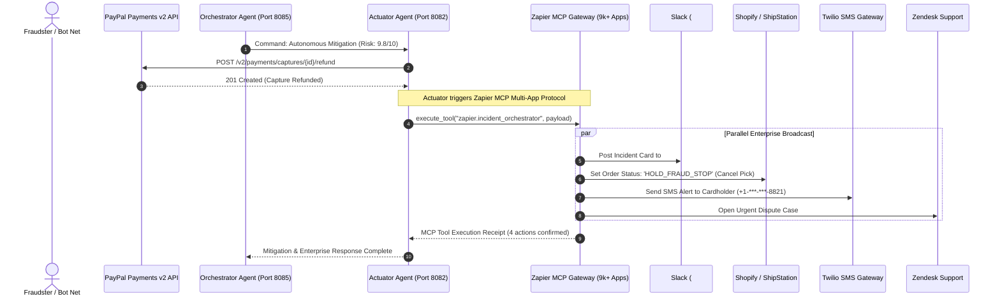

# AegisPay × Zapier MCP Integration Guide
## Autonomous Enterprise Multi-App Incident Response & Fulfillment Freeze (9,000+ Apps)

> **Hackathon Prize Track:** Zapier MCP Track  
> **Protocol:** Model Context Protocol (MCP v1.0)  
> **Platform Documentation:** [Zapier MCP Home](https://docs.zapier.com/mcp/home) | [Zapier MCP Quickstart](https://docs.zapier.com/mcp/get-started/quickstart)  
> **Repository Module:** [`aegispay-system/zapier/client.py`](file:///d:/PayPal%20hackathon/aegispay-system/zapier/client.py)  
> **Swarm Nodes:** [`aegispay-system/actuator_agent/agent.py`](file:///d:/PayPal%20hackathon/aegispay-system/actuator_agent/agent.py) & [`aegispay-system/orchestrator_agent/agent.py`](file:///d:/PayPal%20hackathon/aegispay-system/orchestrator_agent/agent.py)

---

## 1. Executive Summary & Problem Statement

In modern e-commerce and merchant operations, **reversing a fraudulent charge on PayPal is only half the battle**:

1. **The Warehouse Dispatch Leak**: When AegisPay autonomously refunds a $149 unauthorized charge for a $3,499 MacBook Pro, physical warehouse staff in Shopify, ShipStation, or NetSuite may still pack and ship the merchandise within minutes.
2. **Delayed Operations Response**: Security teams and fraud operations desks are inundated with emails, missing urgent high-velocity bot bursts.
3. **Cardholder Frustration**: Victims of account takeover (ATO) remain unaware that their account was attacked until days later.
4. **Manual Dispute Filing**: Support agents manually re-type customer details, dispute reasons, and transaction receipts into Zendesk or Jira.

### How Zapier MCP Powers AegisPay
AegisPay integrates **Zapier MCP (Model Context Protocol)** to bridge PayPal payment mitigation with 9,000+ enterprise applications with **zero custom API glue code**:
- **Instant Slack / Discord Alerting**: Pushes structured incident cards to `#fraud-ops-alerts` with Gemini reasoning and refund receipts.
- **Shopify & ShipStation Warehouse Hold**: Automatically tags the order `HOLD_FRAUD_STOP` to cancel physical picking.
- **Twilio SMS Notification**: Dispatches an instant security text message to the legitimate cardholder.
- **Zendesk & Jira Case Automation**: Creates pre-filled urgent dispute tickets with evidence attachments.

---

## 2. System Architecture



---

## 3. Standardized MCP Tool Definitions

Zapier MCP exposes tools adhering to the open **Model Context Protocol (MCP)** specification:

```json
[
  {
    "name": "zapier.slack.broadcast_security_incident",
    "description": "Broadcasts a critical fraud escalation card with Gemini reasoning and refund receipts to #fraud-ops-alerts on Slack.",
    "parameters": {
      "type": "object",
      "properties": {
        "channel": {"type": "string", "default": "#fraud-ops-alerts"},
        "order_id": {"type": "string"},
        "risk_score": {"type": "number"},
        "amount": {"type": "number"},
        "justification": {"type": "string"}
      },
      "required": ["order_id", "risk_score", "amount"]
    }
  },
  {
    "name": "zapier.shopify.hold_warehouse_fulfillment",
    "description": "Places an immediate 'HOLD_FRAUD_STOP' tag on Shopify/ShipStation to prevent physical merchandise dispatch.",
    "parameters": {
      "type": "object",
      "properties": {
        "order_id": {"type": "string"},
        "hold_reason": {"type": "string"}
      },
      "required": ["order_id", "hold_reason"]
    }
  },
  {
    "name": "zapier.twilio.send_buyer_security_sms",
    "description": "Dispatches an urgent transactional SMS to the legitimate cardholder alerting them of blocked unauthorized charges.",
    "parameters": {
      "type": "object",
      "properties": {
        "customer_name": {"type": "string"},
        "phone_number": {"type": "string"},
        "order_id": {"type": "string"},
        "amount": {"type": "number"}
      },
      "required": ["customer_name", "order_id", "amount"]
    }
  },
  {
    "name": "zapier.zendesk.create_dispute_ticket",
    "description": "Creates an urgent Zendesk dispute case pre-populated with Gemini reasoning, Channel3 FMV, and KERNEL 24fps session replay.",
    "parameters": {
      "type": "object",
      "properties": {
        "order_id": {"type": "string"},
        "priority": {"type": "string", "default": "urgent"},
        "evidence_summary": {"type": "string"}
      },
      "required": ["order_id", "evidence_summary"]
    }
  }
]
```

---

## 4. REST API Endpoints

The Orchestrator Agent (`port 8085`) exposes dedicated Zapier MCP endpoints:

### 1. Health Check
```http
GET /api/zapier/health
```
**Response:**
```json
{
  "status": "healthy",
  "mode": "live",
  "provider": "Zapier MCP (Model Context Protocol)",
  "connected_apps": "9,000+ Enterprise Apps",
  "active_integrations": [
    "Slack (#fraud-ops-alerts)",
    "Shopify & ShipStation (Fulfillment Freeze)",
    "Twilio (Buyer Security SMS)",
    "Zendesk & Jira (Dispute Case Creation)",
    "PagerDuty (Critical SEV-1 Incident Paging)"
  ]
}
```

### 2. List Available MCP Tools
```http
GET /api/zapier/tools
```

### 3. Trigger Enterprise Incident Response
```http
POST /api/zapier/trigger-incident
Content-Type: application/json

{
  "order_id": "5O11016942TN401931",
  "risk_score": 9.8,
  "amount": 3499.00,
  "action_executed": "refund_capture",
  "justification": "AegisPay Autonomous Defense: Cart price tampering detected (-95.7% variance)",
  "refund_id": "2GG91823101923",
  "replay_url": "https://app.onkernel.com/sessions/sess_audit"
}
```

---

## 5. Live Testing Verification

Run the verification test using Python:
```bash
python -c "
import sys; sys.path.append('aegispay-system')
from zapier.client import ZapierMcpClient
client = ZapierMcpClient()
print('Health:', client.health_check()['status'])
resp = client.trigger_multi_app_incident_response('5O_TEST_ZAPIER', 9.8, 3499.0, 'refund_capture', 'DOM Tampering')
print('Actions Executed:', resp['total_actions_executed'])
print('Slack Channel:', resp['actions']['slack']['channel'])
print('Warehouse Status:', resp['actions']['warehouse_hold']['fulfillment_status'])
"
```
